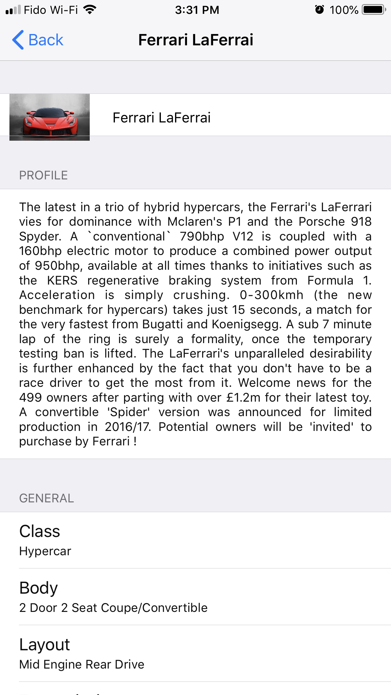

# Supercar Recognition App Using Deep Neural Network

With the trained model, the app can infer Bugatti Chiron, Ferrari LaFerrai, Rolls Royce Wraith Black Badge, Hennessey Venom GT, Lamborghini Huracan Performante, Pagani Huayra Roadster, Mercedes AMG GTR, Porsche 918 Spyder, and Tesla Model S P100D in real time. Once a car is recognized, the user can click on the label button to browse information about that vehicle regarding its profile (review), engine specification, performance, dimensions, competitors and price. Once the user is done browsing, the user can get back to the main page and repeat the process. 

This app has been developed with the intention to classify automobiles in Auto Show Events, and then display car details on a smartphone. However, this app could also be used by car enthusiasts to detect and find information about a car that they have spotted on the go.

## Sample Output

     

## Installation

Clone the project and download the [Car10]() model. Drag it into  the project and Xcode will handle the rest (such as generating .swift file) 

## Warning 

Since real-time forward propagation of nerual network require many hardware resources, you may encounter a number of thermal and performance issues, and don't turn on low-battery mode while runing this app in order to gain better performance.

## License

Permission is hereby granted, free of charge, to any person obtaining a copy of this software and associated documentation files (the "Software"), to deal in the Software without restriction, including without limitation the rights to use, copy, modify, merge, publish, distribute, sublicense, and/or sell copies of the Software, and to permit persons to whom the Software is furnished to do so, subject to the following conditions:

The above copyright notice and this permission notice shall be included in all copies or substantial portions of the Software.

THE SOFTWARE IS PROVIDED "AS IS", WITHOUT WARRANTY OF ANY KIND, EXPRESS OR IMPLIED, INCLUDING BUT NOT LIMITED TO THE WARRANTIES OF MERCHANTABILITY, FITNESS FOR A PARTICULAR PURPOSE AND NONINFRINGEMENT. IN NO EVENT SHALL THE AUTHORS OR COPYRIGHT HOLDERS BE LIABLE FOR ANY CLAIM, DAMAGES OR OTHER LIABILITY, WHETHER IN AN ACTION OF CONTRACT, TORT OR OTHERWISE, ARISING FROM, OUT OF OR IN CONNECTION WITH THE SOFTWARE OR THE USE OR OTHER DEALINGS IN THE SOFTWARE.

## Acknowledgments

This project uses [FrameExtractor](https://github.com/b-r-o/FrameExtractor) for iOS camera frame extraction.

